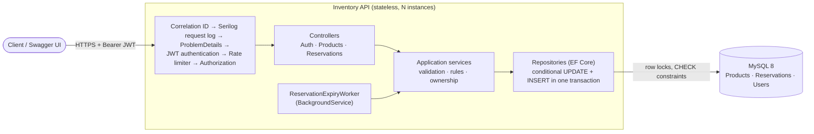
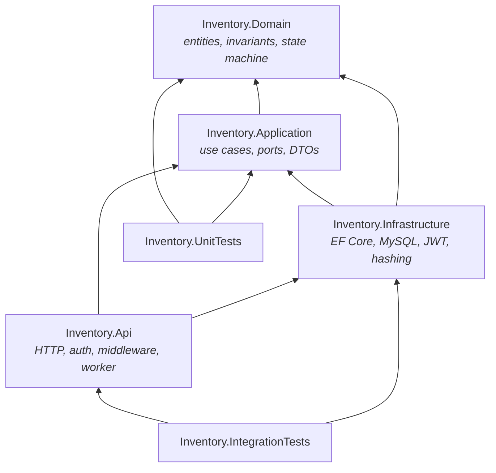
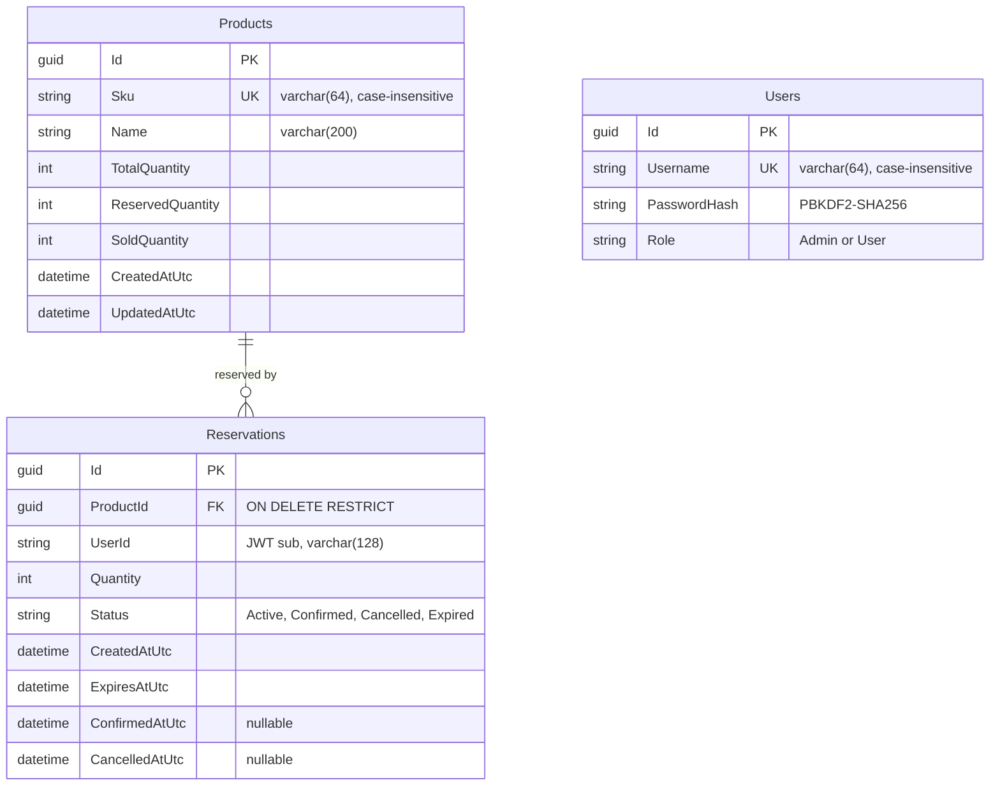
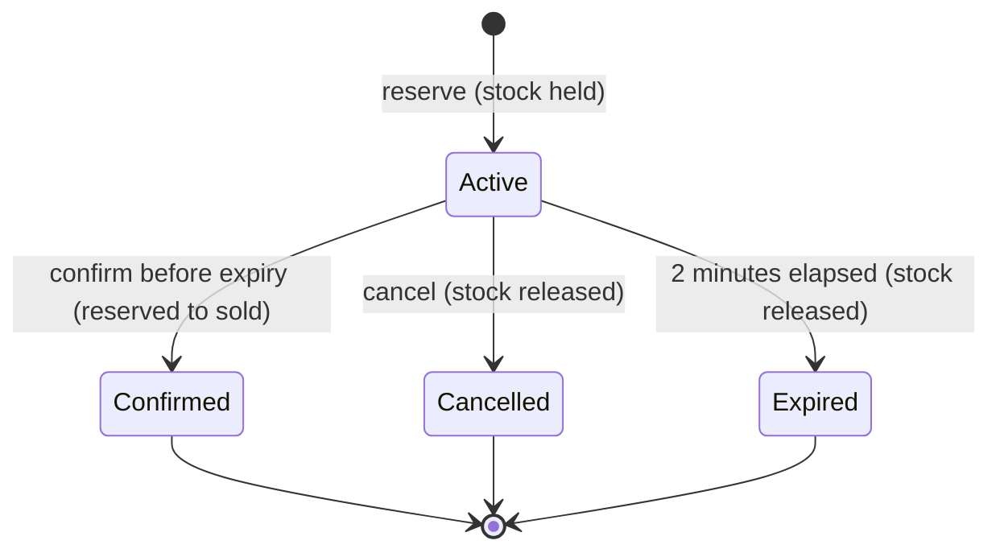

# Inventory Reservation System

A stock-reservation API: users reserve units of a product for **2 minutes**, then **confirm** (buy) or **cancel**;
unconfirmed reservations **expire** automatically. Overselling is impossible, even with hundreds of simultaneous
requests across multiple API instances.

**.NET 9 · ASP.NET Core · EF Core 9 (Pomelo) · MySQL 8 · JWT · Serilog · xUnit · Docker**

> ### Concurrency Verification
>
> ```text
> Stock:       1
> Requests:    500
> Success:     1
> Rejected:    499
> Overselling: 0
> ```
>
> 500 reservation attempts released simultaneously against real MySQL, each in its own DI scope and connection,
> spread across two independently built service containers (two "API instances"). Repeated on every run; it has
> never oversold. With stock 100: **100 succeed, 400 rejected**. Through the full HTTP stack with 500 different
> users and production rate limits: **100 × 201, 400 × 409, 0 × 429**.
>
> **The API is stateless and can be scaled horizontally:** inventory correctness is enforced by MySQL
> (atomic conditional updates inside transactions), not by process-local locks, so adding instances cannot
> introduce races.

---

## Contents

1. [Problem](#1-problem) · 2. [Architecture](#2-architecture) · 3. [Architecture diagram](#3-architecture-diagram) ·
4. [Dependency diagram](#4-clean-architecture-dependency-diagram) · 5. [Project structure](#5-project-structure) ·
6. [Database schema](#6-database-schema) · 7. [Reservation lifecycle](#7-reservation-lifecycle) ·
8. [API endpoints](#8-api-endpoints) · 9. [JWT authentication](#9-jwt-authentication) ·
10. [Authorization](#10-authorization) · 11. [Concurrency strategy](#11-concurrency-strategy) ·
12. [Why no C# `lock`](#12-why-a-c-lock-was-not-used) · 13. [MySQL atomic update](#13-mysql-atomic-update) ·
14. [Transaction boundaries](#14-transaction-boundaries) · 15. [2-minute expiry](#15-2-minute-expiry) ·
16. [Logging](#16-logging) · 17. [Correlation ID](#17-correlation-id) · 18. [Rate limiting](#18-rate-limiting) ·
19. [Error handling](#19-error-handling) · 20. [Unit testing](#20-unit-testing) ·
21. [Integration testing](#21-integration-testing) · 22. [500 concurrent requests](#22-500-concurrent-request-results) ·
23. [Docker setup](#23-docker-setup) · 24. [How to run](#24-how-to-run) · 25. [How to test](#25-how-to-test) ·
26. [Swagger](#26-swagger-usage) · 27. [Assumptions](#27-assumptions) · 28. [Future improvements](#28-future-improvements)

---

## 1. Problem

Products have a fixed stock. Many users may try to reserve the last units at the same moment. The system must:

- never let `reserved + sold` exceed `total`, under any concurrency, on any number of API instances;
- hold reserved stock for 2 minutes, then release it automatically if not confirmed;
- allow each reservation exactly one terminal transition (confirmed, cancelled **or** expired) — no double sale,
  no double release;
- be secure (JWT, roles, ownership), observable, and fail with consistent, non-leaking errors.

## 2. Architecture

Clean Architecture with four projects. Dependencies point inwards; the domain has no framework references.

| Layer | Responsibility |
|---|---|
| **Domain** | `Product`, `Reservation`, `User`; invariants and the state machine; pure C#, no EF/ASP.NET. |
| **Application** | Use cases (`ProductService`, `ReservationService`, `ReservationExpiryService`, `AuthService`), validation, DTOs, ports (`IReservationRepository`, `IPasswordHasher`, `IJwtTokenGenerator`, `ICurrentUser`). |
| **Infrastructure** | EF Core/MySQL (`AppDbContext`, configurations, migrations, repositories with the atomic SQL), PBKDF2 hashing, JWT issuing. |
| **Api** | Thin controllers, JWT validation, authorization policies, ProblemDetails, Serilog, correlation IDs, rate limiting, Swagger, health checks, the expiry `BackgroundService`. |

Controllers only translate HTTP ↔ use case. All stock arithmetic happens **in the database**, in a single statement.

## 3. Architecture diagram



## 4. Clean Architecture dependency diagram



## 5. Project structure

```text
InventoryReservationSystem.sln
├── src/
│   ├── Inventory.Domain/          Entities/ Enums/ Exceptions/
│   ├── Inventory.Application/     Abstractions/ Auth/ Products/ Reservations/ Common/
│   ├── Inventory.Infrastructure/  Persistence/{Configurations,Repositories,Migrations,Seeding}/ Authentication/
│   └── Inventory.Api/             Controllers/ Auth/ BackgroundJobs/ ErrorHandling/ Observability/ OpenApi/ RateLimiting/
├── tests/
│   ├── Inventory.UnitTests/         Domain/ Application/
│   └── Inventory.IntegrationTests/  Auth/ Products/ Reservations/ ErrorHandling/ Observability/ RateLimiting/ OpenApi/ Persistence/ Support/
├── Dockerfile · docker-compose.yml · .env.example
```

## 6. Database schema



- `AvailableQuantity = TotalQuantity − ReservedQuantity − SoldQuantity` is computed, never stored.
- **CHECK constraints** as a last line of defence: all quantities `>= 0`, `ReservedQuantity + SoldQuantity <= TotalQuantity`,
  `Reservations.Quantity > 0`.
- **Indexes:** `UX_Products_Sku`, `UX_Users_Username`, `IX_Reservations_ProductId`, `IX_Reservations_Status`,
  `IX_Reservations_ExpiresAtUtc`, and `IX_Reservations_Status_ExpiresAtUtc` for the expiry sweep.
- All timestamps are UTC (`datetime(6)`, a value converter marks them `DateTimeKind.Utc`). Two migrations:
  `InitialCreate`, `AddUsers`.

## 7. Reservation lifecycle



`Active` is the only non-terminal state. Terminal states can never transition again (enforced by the domain **and**
by `WHERE Status = 'Active'` in every transition statement).

## 8. API endpoints

| Method | Route | Auth | Success | Errors |
|---|---|---|---|---|
| `POST` | `/api/v1/auth/login` | anonymous | `200` JWT | `400`, `401 INVALID_CREDENTIALS`, `429` |
| `POST` | `/api/v1/products` | **Admin** | `201` + `Location` | `400`, `401`, `403`, `409 DUPLICATE_SKU` |
| `GET` | `/api/v1/products/{id}` | user | `200` | `401`, `404` |
| `POST` | `/api/v1/reservations` | user | `201` | `400`, `401`, `404 PRODUCT_NOT_FOUND`, `409 INSUFFICIENT_STOCK`, `429` |
| `POST` | `/api/v1/reservations/{id}/confirm` | owner/Admin | `200` | `401`, `403`, `404`, `409 INVALID_RESERVATION_STATE` / `RESERVATION_EXPIRED` |
| `POST` | `/api/v1/reservations/{id}/cancel` | owner/Admin | `200` | `401`, `403`, `404`, `409 INVALID_RESERVATION_STATE` |
| `GET` | `/health` · `/health/ready` | anonymous | `200` | `503` (ready: database unreachable) |

```json
POST /api/v1/reservations   { "productId": "6f9c…", "quantity": 1 }
201 Created                 { "reservationId": "…", "productId": "6f9c…", "quantity": 1, "status": "Active",
                              "createdAtUtc": "…", "expiresAtUtc": "…+2 min", "confirmedAtUtc": null, "cancelledAtUtc": null }
```

## 9. JWT authentication

- `POST /api/v1/auth/login` verifies the password and issues an **HMAC-SHA256** JWT with claims `sub` (user id),
  `username`, `role` (+ `jti`, `iat`, `nbf`, `exp`).
- Validation: issuer, audience, signature, lifetime (30 s clock skew), algorithm pinned to HS256.
- Configuration `Jwt:Issuer`, `Jwt:Audience`, `Jwt:ExpirationMinutes` (default 60) in `appsettings.json`;
  **`Jwt:SigningKey` only from environment / secret store** (validated at startup, ≥ 32 bytes).
- Passwords: **PBKDF2-HMAC-SHA256, 600,000 iterations, random 16-byte salt**, constant-time comparison. Unknown usernames
  run the same key derivation, so response timing does not reveal which usernames exist.
- No registration endpoint; bootstrap users are seeded from configuration (`SeedUsers__0__Username`, …), never from code.

## 10. Authorization

- **Secure by default:** a fallback policy requires an authenticated user on every endpoint; only login, health and
  Swagger opt out.
- `POST /products` requires the **Admin** role (`AdminOnly` policy). Reads and reservations: any authenticated user.
- **Ownership:** a user can confirm/cancel only their own reservations (`Reservation.UserId == sub`); Admins can act on
  any. Violations return `403 FORBIDDEN`.

## 11. Concurrency strategy

| Operation | Guard (single SQL statement) | Race outcome |
|---|---|---|
| Reserve | `UPDATE Products … WHERE Id=@id AND Total−Sold−Reserved >= @q` | stock never negative |
| Confirm | `UPDATE Reservations … WHERE Id=@id AND Status='Active' AND ExpiresAtUtc > @now` | sold exactly once |
| Cancel | `UPDATE Reservations … WHERE Id=@id AND Status='Active'` | released exactly once |
| Expire | `UPDATE Reservations … WHERE Id=@id AND Status='Active' AND ExpiresAtUtc <= @now` | released exactly once |

Each guard is evaluated by InnoDB **under the row lock**: concurrent writers queue on the row, and each re-checks the
`WHERE` against the latest committed data. Exactly one competitor matches; the rest affect 0 rows and are rejected
cleanly (`409`). The stock change happens in the same transaction, only if the guard matched.

There is no "read, check in C#, write later" anywhere in the write path. The domain still validates transitions first
(for clear errors in the common case), but the database is the arbiter under contention.

## 12. Why a C# `lock` was NOT used

- **It only works inside one process.** Two API instances (or a restart during a request) each have their own lock —
  overselling would return the moment you scale out.
- **It serializes all requests** for a product (or for everything) through one thread, destroying throughput, while
  the database already provides row-level locking for exactly the rows that conflict.
- **It cannot coordinate with the database**: the expiry worker, other services or manual SQL would bypass it.
- `SemaphoreSlim`, static mutexes and in-memory caches have the same flaws. None are used; correctness is a property
  of the data store, so the API stays **stateless and horizontally scalable**.

## 13. MySQL atomic update

The reservation hold (EF Core `ExecuteUpdateAsync`, parameterized):

```sql
UPDATE Products
SET    ReservedQuantity = ReservedQuantity + @quantity,
       UpdatedAtUtc     = @now
WHERE  Id = @productId
  AND  TotalQuantity - SoldQuantity - ReservedQuantity >= @quantity;
```

- **1 row affected** → stock held, insert the `Active` reservation.
- **0 rows affected** → roll back; a read-only existence check decides `404 PRODUCT_NOT_FOUND` vs
  `409 INSUFFICIENT_STOCK`. That read only classifies the error — it never decides stock.

## 14. Transaction boundaries

| Use case | One transaction containing | On failure |
|---|---|---|
| Reserve | conditional stock `UPDATE` → reservation `INSERT` | `INSERT` fails ⇒ explicit rollback releases the stock (tested) |
| Confirm | conditional status `UPDATE` → `Reserved −= q, Sold += q` | guard 0 rows ⇒ rollback, `409` |
| Cancel | conditional status `UPDATE` → `Reserved −= q` | guard 0 rows ⇒ rollback, `409` |
| Expire (per reservation) | conditional status `UPDATE` → `Reserved −= q` | lost race ⇒ rollback, skipped |

The second statement carries a defensive guard (`ReservedQuantity >= q`); if it ever affected no row, the transaction is
rolled back rather than committing an inconsistent state. Transactions are short (two statements) to keep row-lock
hold time minimal.

## 15. 2-minute expiry

- `ExpiresAtUtc = CreatedAtUtc + 2 minutes` is set by the domain at creation.
- **Confirm is refused at or after `ExpiresAtUtc`** — both in the domain and in the SQL guard — so a late confirm
  never succeeds even if the sweeper has not run yet.
- `ReservationExpiryWorker` (`BackgroundService`, `PeriodicTimer`) runs every `ReservationExpiry:PollingInterval`
  (default 15 s), reads due `Active` reservations via `IX_Reservations_Status_ExpiresAtUtc` in batches of 100, and expires
  each with the conditional transition above. Every instance may run it; overlap is harmless (tested with 8 concurrent
  sweepers). Honors cancellation and stops gracefully.
- Time is injected (`TimeProvider`), so tests move the clock instead of waiting two minutes.

## 16. Logging

Serilog, structured JSON to stdout (container-friendly). One event per request with `CorrelationId`, `RequestMethod`,
`RequestPath`, `StatusCode`, `Elapsed` (ms) and `UserId`/`ProductId`/`ReservationId` when known, plus business events
(reservation created/confirmed/cancelled/expired, product created, login success/failure).

**Never logged:** request/response bodies, headers (so no `Authorization`/JWT), query strings, passwords, connection
strings, secrets. EF SQL logging is at Warning and parameter values are never logged. A test captures every log
event during real logins and authenticated calls and asserts none of these appear.

## 17. Correlation ID

`X-Correlation-ID` is accepted from the caller if well-formed (≤ 64 chars, `[A-Za-z0-9._:-]`, preventing log/header
injection), otherwise generated. It is returned in the response header, attached to every log event of the request,
and included as `correlationId` in every error response.

## 18. Rate limiting

ASP.NET Core's built-in rate limiter, partitioned **per client** (JWT `sub`, or IP when anonymous):

| Policy | Limit |
|---|---|
| General (all endpoints) | 600 requests / minute (fixed window) |
| Login | 10 attempts / minute per IP (brute-force protection) |
| Reservations | token bucket: burst 60, +30 every 10 s per user |

Exceeding returns `429 RATE_LIMITED` with `Retry-After`. Health checks are exempt. **Rate limiting protects capacity,
it is not concurrency control:** because limits are per client, 500 different users reserving at once all reach the
database — and the database alone keeps the stock correct (verified, §22).

## 19. Error handling

Every error is RFC 9457 `application/problem+json` with the same shape, from one `ErrorCatalog`:

```json
{
  "type": "https://tools.ietf.org/html/rfc9110#section-15.5.10",
  "title": "Insufficient inventory",
  "status": 409,
  "detail": "Product '6f9c…' does not have 3 unit(s) available.",
  "instance": "/api/v1/reservations",
  "errorCode": "INSUFFICIENT_STOCK",
  "correlationId": "4b1f0c…"
}
```

| Status | Codes |
|---|---|
| 400 | `VALIDATION_FAILED` (with per-field `errors`), `BAD_REQUEST` |
| 401 | `UNAUTHORIZED`, `INVALID_CREDENTIALS` |
| 403 | `FORBIDDEN` |
| 404 | `PRODUCT_NOT_FOUND`, `RESERVATION_NOT_FOUND`, `NOT_FOUND` |
| 409 | `INSUFFICIENT_STOCK`, `INVALID_RESERVATION_STATE`, `RESERVATION_EXPIRED`, `RESERVATION_CONCURRENTLY_MODIFIED`, `DUPLICATE_SKU` |
| 429 | `RATE_LIMITED` |
| 500 | `INTERNAL_ERROR` — generic message only |

Unexpected exceptions never expose SQL, stack traces, connection strings or internal types (tested with an exception
message deliberately containing all of them); details are logged server-side with the correlation ID.

## 20. Unit testing

**88 tests**, no I/O:

- **Domain:** quantity invariants, available-stock arithmetic, every allowed and forbidden reservation transition,
  terminal states, expiry boundary (one tick before / exactly at), user invariants.
- **Application:** validation of every request, outcome → exception mapping, ownership, lost-race handling,
  expiry batching and cancellation, login (including the constant-time unknown-user path), clock truncation to
  MySQL's microsecond precision.

## 21. Integration testing

**158 tests** through the real ASP.NET Core pipeline (`WebApplicationFactory`):

- **API without a database** (always run): routing, contracts, validation, authentication (valid/forged/expired/
  wrong-audience tokens), authorization (403s), ProblemDetails for every error path, correlation IDs, log hygiene,
  rate limiting, the OpenAPI document.
- **Real MySQL** (run when `INVENTORY_TEST_MYSQL` is set; each class gets a throwaway database): persistence and schema,
  unique SKU/username races, reserve/confirm/cancel/expiry end to end, transaction rollback on a failed insert,
  migrate-on-startup on an empty database, readiness, seeding, and all concurrency tests.

Race tests were validated by mutation: removing the `Status = 'Active'` guard makes exactly the race tests fail.

## 22. 500 concurrent request results

All against real MySQL, all requests released simultaneously from a start gate. Repeated across many runs
(including 5× and 3× dedicated repetition sessions) with **zero failures and zero overselling**.

| Scenario | Requests | Result | Overselling |
|---|---|---|---|
| Stock 1 | 500 | **1 success, 499 rejected** | 0 |
| Stock 100 | 500 | **100 success, 400 rejected** | 0 |
| Stock 100, full HTTP stack, 500 distinct users, production rate limits | 500 | **100 × 201, 400 × 409, 0 × 429** | 0 |
| Concurrent confirm (same reservation) | 20 | exactly 1 × 200, 19 × 409; sold once | — |
| Concurrent cancel (same reservation) | 20 | exactly 1 × 200; released once | — |
| Confirm vs cancel | 10 rounds × 20 | exactly one winner per round; stock matches winner | — |
| Expiry with 8 concurrent sweepers | 40 due | each expired exactly once | — |
| Expiry vs confirm / expiry vs cancel | 10 rounds each | exactly one winner; no double release | — |

After every run the database is checked: `ReservedQuantity` equals the number of successes, `SoldQuantity` is 0,
`AvailableQuantity` is never negative, and the number of `Active` reservation rows matches.

## 23. Docker setup

- **Dockerfile:** multi-stage (`sdk:9.0` → `aspnet:9.0`), layer-cached restore, runs as the non-root `app` user on
  port 8080, `HEALTHCHECK` on `/health/ready`.
- **docker-compose.yml:** `mysql` (MySQL 8, persistent volume `mysql-data`, health check) and `inventory-api`
  (waits for MySQL to be healthy, applies EF migrations on startup with retry, seeds the optional admin, health check).
- **Secrets:** only from `.env` (`${VAR:?}` — compose refuses to start without them); `.env` is gitignored and excluded
  from the build context. Verified: no secret value exists in any image layer.

## 24. How to run

**Docker (recommended):**

```bash
cp .env.example .env     # set MYSQL_* passwords, JWT_SIGNING_KEY (openssl rand -base64 48), DEMO_ADMIN_PASSWORD
docker compose up --build
```

API: <http://localhost:8080> · Swagger: <http://localhost:8080/swagger> · Health: <http://localhost:8080/health/ready>

```bash
TOKEN=$(curl -s -X POST localhost:8080/api/v1/auth/login -H "Content-Type: application/json" \
  -d '{"username":"admin","password":"<DEMO_ADMIN_PASSWORD>"}' | sed -E 's/.*"accessToken":"([^"]+)".*/\1/')

curl -X POST localhost:8080/api/v1/products -H "Authorization: Bearer $TOKEN" -H "Content-Type: application/json" \
  -d '{"sku":"IPHONE-001","name":"iPhone","totalQuantity":10}'
```

**Locally (API outside Docker):** start only MySQL (`docker compose up -d mysql`), then

```bash
export ConnectionStrings__DefaultConnection="Server=localhost;Port=3306;Database=inventory;User=inventory;Password=<MYSQL_PASSWORD>"
export Jwt__SigningKey="<32+ byte secret>" Database__MigrateOnStartup=true
export SeedUsers__0__Username=admin SeedUsers__0__Password="<password>" SeedUsers__0__Role=Admin
dotnet run --project src/Inventory.Api        # http://localhost:5048, Swagger at /swagger
```

## 25. How to test

```bash
dotnet test                     # 246 tests; MySQL-backed ones are skipped without a database (~30 s)
```

Full suite including MySQL persistence and the concurrency tests (uses the compose MySQL; each test class creates and
drops its own `inv_test_*` database, so your data is untouched):

```bash
docker compose up -d mysql
export INVENTORY_TEST_MYSQL="Server=localhost;Port=3306;User=root;Password=<MYSQL_ROOT_PASSWORD>"
dotnet test                     # 246 passed, 0 failed, ~80 s
```

The 500-request load tests run in their own non-parallel collection so they measure correctness, not the test
machine; compose sets `max_connections=1000` so all 500 requests run truly in parallel.

## 26. Swagger usage

1. Open <http://localhost:8080/swagger>.
2. `POST /api/v1/auth/login` → **Try it out** → enter credentials → **Execute**.
3. Copy `accessToken` from the response.
4. Click **Authorize**, paste the token (without `Bearer `) → **Authorize** → **Close**.
5. Padlocked endpoints now send `Authorization: Bearer <token>`.

The OpenAPI document includes summaries, request/response schemas with field descriptions, every response code
(401/403/429 derived from the real authorization and rate-limit metadata) and the JWT Bearer security scheme.
Swagger is on in Development and in the compose stack (`SWAGGER_ENABLED`); off by default in Production.

## 27. Assumptions

- A reservation is for one product; `quantity > 0`. Identifiers are GUIDs (the spec's `"productId": 1` became a GUID).
- `AvailableQuantity = Total − Reserved − Sold`; stock cannot be changed after creation (no restock endpoint yet).
- The reservation owner is the JWT `sub`. Users are provisioned via configuration; there is no self-registration.
- Expired-but-not-yet-swept reservations cannot be confirmed (time is checked at confirm) but can still be cancelled;
  their stock is released at most one polling interval (15 s) after expiry.
- API servers keep UTC clocks synchronized (NTP); expiry decisions use the application clock.
- SKUs and usernames are unique case-insensitively (MySQL default collation).
- Rate-limit counters are per API instance (in-memory), which is acceptable for throttling but not a global quota.
- One MySQL primary is the source of truth.

## 28. Future improvements

- **Idempotency keys** on `POST /reservations` so client retries cannot create duplicate holds.
- Read endpoints: `GET /reservations/{id}`, "my reservations", product listing with pagination; restock/adjust stock.
- **Distributed rate limiting** (e.g. Redis) for global quotas across instances.
- External identity provider (OIDC) or refresh tokens; key rotation via a secret manager.
- Outbox + domain events (reservation confirmed/expired) for downstream systems.
- `SELECT … FOR UPDATE SKIP LOCKED` to let many sweepers split expiry work instead of overlapping.
- OpenTelemetry tracing/metrics (reservation latency, contention, expiry lag) and dashboards.
- CI pipeline running the MySQL suite via Testcontainers; load testing at higher scale (k6).
- Persist ASP.NET Data Protection keys if cookie/antiforgery features are ever added.
