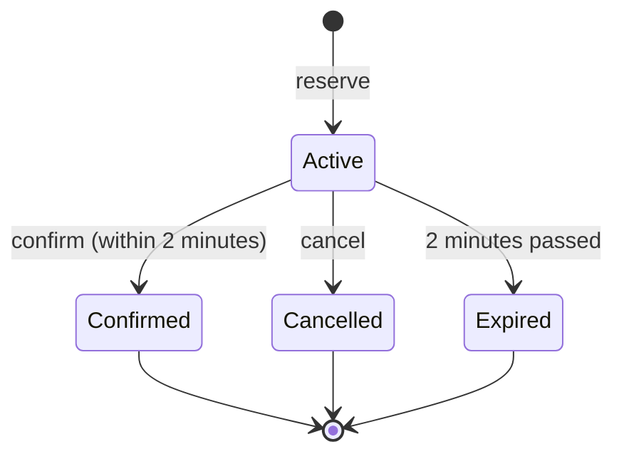

# Inventory Reservation System

An API for reserving products. A user reserves some stock, and it is held for **2 minutes**. In that time they can
**confirm** it (buy it) or **cancel** it. If they do neither, the reservation **expires** and the stock goes back on
sale.

The main promise: **you can never sell more than you have**, even when hundreds of people try to buy the last item
at the same moment, and even when several copies of the API are running.

**.NET 9 · ASP.NET Core · EF Core 9 · MySQL 8 · JWT · Serilog · xUnit · Docker**

> ### Proof: 500 people, 1 item
>
> ```text
> Stock:       1
> Requests:    500 at the same moment
> Success:     1
> Rejected:    499
> Overselling: 0
> ```
>
> This test runs against a real MySQL database, on every test run, and has never oversold.

---

## Contents

1. [How it works in one minute](#1-how-it-works-in-one-minute)
2. [How to run](#2-how-to-run)
3. [How to test](#3-how-to-test)
4. [API endpoints](#4-api-endpoints)
5. [Project structure](#5-project-structure)
6. [Reservation lifecycle](#6-reservation-lifecycle)
7. [How overselling is prevented](#7-how-overselling-is-prevented)
8. [Expiry](#8-expiry)
9. [Security](#9-security)
10. [Errors](#10-errors)
11. [Logging and rate limiting](#11-logging-and-rate-limiting)
12. [Tests](#12-tests)
13. [Assumptions](#13-assumptions)
14. [Future improvements](#14-future-improvements)

---

## 1. How it works in one minute

Each product stores three numbers: **total** stock, how many are **reserved**, and how many are **sold**.
What is still available is simply whatever is left over.

- **Reserve:** move some units from available to reserved.
- **Confirm:** move them from reserved to sold.
- **Cancel or expire:** give them back to available.

Every one of these steps is done **by the database in a single step**, so two requests can never both grab the
same unit. The API itself keeps no shared state in memory, which is why you can run as many copies of it as you like.

A request for "Create Reservation" flows like this:

```text
ReservationsController  →  ReservationService  →  ReservationRepository  →  MySQL
   (HTTP in/out)            (rules, validation)    (one database transaction)
```

## 2. How to run

**With Docker (recommended).** You do not need to install MySQL or create a database; Docker does it for you.

```bash
cp .env.example .env     # fill in the passwords and a JWT signing key
docker compose up --build
```

Then open:

- Swagger UI: <http://localhost:8080/swagger>
- Health check: <http://localhost:8080/health/ready>

Log in as the admin user from your `.env` (`DEMO_ADMIN_USERNAME` / `DEMO_ADMIN_PASSWORD`).

**Without Docker for the API** (MySQL still in Docker):

```bash
docker compose up -d mysql
export ConnectionStrings__DefaultConnection="Server=localhost;Port=3306;Database=inventory;User=inventory;Password=<MYSQL_PASSWORD>"
export Jwt__SigningKey="<a long random secret>" Database__MigrateOnStartup=true
export SeedUsers__0__Username=admin SeedUsers__0__Password="<password>" SeedUsers__0__Role=Admin
dotnet run --project src/Inventory.Api
```

**Using Swagger:**

1. Call `POST /api/v1/auth/login` with your username and password.
2. Copy the `accessToken` from the response.
3. Click **Authorize**, paste the token, click **Authorize**, then **Close**.
4. All other endpoints now work.

A Postman collection is also included in `docs/postman/`.

## 3. How to test

Make sure Docker is running, then:

```bash
dotnet test                     # 248 passed, 0 failed, 0 skipped (~2 min)
```

That runs everything, including the real-MySQL and 500-request concurrency tests. The tests start their own
temporary MySQL container and remove it at the end; you do not need to start MySQL or set anything up.

To use an existing MySQL server instead (for example the one from `docker compose`), set this first:

```bash
export INVENTORY_TEST_MYSQL="Server=localhost;Port=3306;User=root;Password=<MYSQL_ROOT_PASSWORD>"
```

Each test class creates its own temporary database and deletes it afterwards, so your data is never touched.

## 4. API endpoints

| Method | Route | Who can call it | What it does |
|---|---|---|---|
| `POST` | `/api/v1/auth/login` | anyone | Log in and get a token |
| `POST` | `/api/v1/products` | **Admin** only | Create a product |
| `GET` | `/api/v1/products/{id}` | logged-in user | See a product and its stock |
| `POST` | `/api/v1/reservations` | logged-in user | Reserve stock for 2 minutes |
| `POST` | `/api/v1/reservations/{id}/confirm` | owner or Admin | Buy the reserved stock |
| `POST` | `/api/v1/reservations/{id}/cancel` | owner or Admin | Give the stock back |
| `GET` | `/health`, `/health/ready` | anyone | Is the API (and database) up? |

Example:

```json
POST /api/v1/reservations
{ "productId": "6f9c…", "quantity": 1 }

201 Created
{ "reservationId": "…", "productId": "6f9c…", "quantity": 1, "status": "Active",
  "createdAtUtc": "…", "expiresAtUtc": "… (2 minutes later)" }
```

## 5. Project structure

The code follows Clean Architecture: four projects, each with one job.

| Project | What lives there |
|---|---|
| **Inventory.Domain** | The business objects (`Product`, `Reservation`, `User`) and their rules. No database or web code. |
| **Inventory.Application** | The use cases: create, confirm, cancel and expire reservations; create products; log in. |
| **Inventory.Infrastructure** | Talking to MySQL (EF Core), password hashing, creating JWT tokens. |
| **Inventory.Api** | Controllers, login checks, error responses, logging, rate limiting, Swagger, and the background expiry job. |

```text
src/
  Inventory.Domain/
  Inventory.Application/
  Inventory.Infrastructure/
  Inventory.Api/
tests/
  Inventory.UnitTests/
  Inventory.IntegrationTests/
```

**Good files to read first:**

| Topic | Files |
|---|---|
| Create Reservation | `ReservationsController.cs` → `ReservationService.cs` → `Reservation.cs` |
| Overselling protection | `ReservationRepository.cs`, `TransientMySqlRetry.cs` |
| Confirm / Cancel | `Reservation.cs`, `ReservationService.cs`, `ReservationRepository.cs` |
| Expiry | `ReservationExpiryWorker.cs` → `ReservationExpiryService.cs` |
| Login / JWT | `AuthService.cs`, `JwtTokenGenerator.cs`, `AuthenticationSetup.cs` |

## 6. Reservation lifecycle



A reservation starts as **Active**. It can move to **one** final state, and only once. A confirmed reservation can
never be cancelled, and an expired one can never be confirmed.

## 7. How overselling is prevented

**The idea:** never "read the stock, check it in C#, then save". Between the read and the save, someone else could
take the same unit. Instead, the check and the change happen **together, in one database statement**.

Reserving stock runs this SQL:

```sql
UPDATE Products
SET    ReservedQuantity = ReservedQuantity + @quantity
WHERE  Id = @productId
  AND  (enough stock is still available);
```

- If the database updated the row, the stock was available and is now held. The reservation is saved
  **in the same transaction**, so both are saved, or neither is.
- If no row was updated, there was not enough stock and the user gets `409 INSUFFICIENT_STOCK`.

When 500 requests arrive at once, MySQL lines them up on that product's row and checks each one against the latest
numbers. Only as many succeed as there is stock.

Confirm, cancel and expire work the same way. Each one only succeeds **if the reservation is still Active**, so if two
requests race (for example, confirm and cancel at the same moment), exactly one wins and the other gets a `409`.

**Why not a C# `lock`?** A `lock` only works inside one running copy of the API. With two copies, each has its own
lock, and overselling comes back. The database is shared by every copy, so it is the right place to enforce this.
No `lock`, `SemaphoreSlim` or in-memory state is used.

**If the database is very busy**, MySQL may occasionally abort a transaction (a deadlock or a lock timeout). The API
then retries it, up to 3 times. Retrying is safe because each step only applies once. If all 3 tries fail, nothing
was changed and the user gets `503 TEMPORARILY_UNAVAILABLE` and can try again.

## 8. Expiry

- Every reservation gets an expiry time 2 minutes after it is created.
- A background job checks every **15 seconds** for reservations past their expiry time, marks them **Expired**, and
  puts their stock back.
- Confirming after 2 minutes is always refused with `409 RESERVATION_EXPIRED`, even if the background job has not
  run yet.
- Several copies of the API can run the job at the same time safely; each reservation is still expired only once.
- If one reservation cannot be expired, it is logged and retried next time, and the others still expire normally.

## 9. Security

- **Login** returns a **JWT token**. Send it on every other request as `Authorization: Bearer <token>`.
- The token contains the user id, username and role, and is valid for 60 minutes by default.
- **Every endpoint requires a token** unless it is explicitly public (login, health, Swagger).
- Only an **Admin** can create products.
- Users can only confirm or cancel **their own** reservations (Admins can act on any). Otherwise: `403 FORBIDDEN`.
- Passwords are stored as strong one-way hashes (PBKDF2), never as plain text.
- Secrets (database passwords, the JWT signing key) come from environment variables or `.env`. They are never in
  the code and never written to logs. `.env` is not committed to git.

## 10. Errors

Every error has the same JSON shape, so clients can handle them in one place (shortened example):

```json
{
  "title": "Insufficient inventory",
  "status": 409,
  "detail": "Product '6f9c…' does not have 3 unit(s) available.",
  "errorCode": "INSUFFICIENT_STOCK",
  "correlationId": "4b1f0c…"
}
```

| Status | Meaning | Error codes |
|---|---|---|
| 400 | The request is invalid | `VALIDATION_FAILED`, `BAD_REQUEST` |
| 401 | Not logged in, or wrong password | `UNAUTHORIZED`, `INVALID_CREDENTIALS` |
| 403 | Logged in, but not allowed | `FORBIDDEN` |
| 404 | Not found | `PRODUCT_NOT_FOUND`, `RESERVATION_NOT_FOUND`, `NOT_FOUND` |
| 409 | Conflicts with the current state | `INSUFFICIENT_STOCK`, `INVALID_RESERVATION_STATE`, `RESERVATION_EXPIRED`, `RESERVATION_CONCURRENTLY_MODIFIED`, `DUPLICATE_SKU` |
| 429 | Too many requests | `RATE_LIMITED` |
| 500 | Unexpected server error (no internal details shown) | `INTERNAL_ERROR` |
| 503 | Database too busy, nothing changed; retry shortly | `TEMPORARILY_UNAVAILABLE` |

## 11. Logging and rate limiting

**Logging:** structured JSON logs (Serilog). Every request is logged with its path, status code, duration and a
**correlation ID**. That same ID is returned in the `X-Correlation-ID` header and in every error, so a reported error
can be found in the logs. Passwords, tokens and connection strings are never logged.

**Rate limiting:** each user (or IP address, when not logged in) has a request limit, for example 10 login attempts
per minute. Going over it returns `429`. The limits are per user, so 500 *different* users reserving at once all reach
the database, and the database alone keeps stock correct.

## 12. Tests

- **84 unit tests:** the business rules (allowed and forbidden status changes, expiry timing, validation, ownership,
  login).
- **164 integration tests:** the real API from end to end, including login, permissions, error responses, logging,
  and rate limiting. They also check saving to the database and all the race conditions, against a real MySQL.

**Concurrency results (real MySQL):**

| Scenario | Result |
|---|---|
| 500 requests for 1 item | 1 success, 499 rejected, no overselling |
| 500 requests for 100 items | 100 successes, 400 rejected, no overselling |
| Same, through the full HTTP API with 500 different users | 100 × `201`, 400 × `409`, none rate limited |
| 20 confirms of the same reservation | exactly 1 succeeds, sold once |
| 20 cancels of the same reservation | exactly 1 succeeds, stock returned once |
| Confirm vs cancel at the same moment | exactly one wins each time |
| 8 expiry jobs running at once | each reservation expired once |
| Expiry vs confirm, expiry vs cancel | exactly one wins, stock returned at most once |

After every run, the test also checks the stock numbers stored in the database.

## 13. Assumptions

- A reservation is for one product and a quantity of at least 1.
- Ids are GUIDs.
- Stock is set when a product is created; there is no restock endpoint yet.
- Users are created from configuration; there is no sign-up endpoint.
- An expired reservation may wait up to 15 seconds for the background job, but it can never be confirmed in that time.
- Product SKUs and usernames are unique, ignoring upper/lower case.
- One MySQL database is the single source of truth.

## 14. Future improvements

- **Very popular products:** all requests for one product wait in line for that product's row. Stock stays correct,
  but in a big flash sale requests get slower. This could be improved by failing fast after a short wait, or by
  limiting how many requests per product run at once.
- **Idempotency keys**, so a client that retries a request does not create two reservations.
- More endpoints: get a reservation, list my reservations, list products, restock.
- Shared rate limits across all API copies (for example, with Redis).
- Let the expiry jobs on different API copies split the work instead of overlapping.
- Metrics and tracing (OpenTelemetry), and a CI pipeline that runs the MySQL tests.
